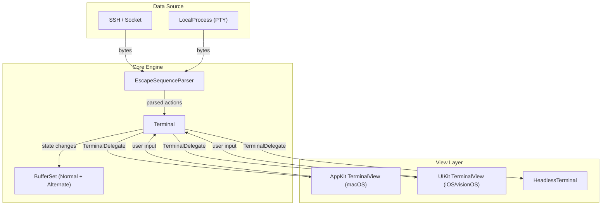
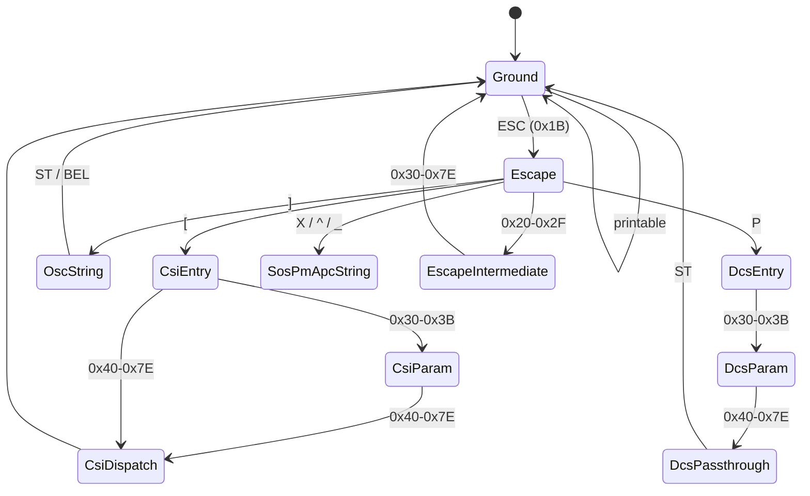

<a id="overview"></a>
# SwiftTerm Architecture

SwiftTerm is a VT100/Xterm terminal emulator written in Swift. The engine is UI-agnostic — it processes byte streams and maintains buffer state — while platform-specific views handle rendering and input.

<a id="high-level"></a>
## High-Level Layers



<a id="parser-pipeline"></a>
## Parser Pipeline

The escape sequence parser (`EscapeSequenceParser`) implements a state machine derived from the [VT500-series parser model](https://vt100.net/emu/dec_ansi_parser). Bytes flow through these states:



Key dispatch paths:

| Sequence type | Prefix | Handler location |
|---------------|--------|-----------------|
| **CSI** (Control Sequence Introducer) | `ESC [` | `Terminal.swift` — `csiHandler` dispatch table |
| **OSC** (Operating System Command) | `ESC ]` | `Terminal.swift` — `oscHandler` |
| **DCS** (Device Control String) | `ESC P` | Pluggable `DcsHandler` protocol (e.g. `SixelDcsHandler`) |
| **ESC** sequences | `ESC` + char | `Terminal.swift` — `escHandler` |
| **Printable** characters | — | Direct buffer write via `Terminal.print()` |

<a id="buffer-system"></a>
## Buffer System

`Terminal` owns a `BufferSet` containing two `Buffer` instances: **normal** and **alternate**. Applications switch between them (e.g. `vim` uses the alternate screen).

Each `Buffer` contains:

- **`lines`**: A `CircularBufferLineList` of `BufferLine` objects (active rows + scrollback).
- **Cursor state**: `x`, `y` position, saved cursor for save/restore.
- **Scroll region**: Top and bottom margins for scrolling operations.
- **Tab stops**: Configurable tab stop positions.

Each `BufferLine` holds an array of `CharData` cells. Each `CharData` packs:

- A Unicode `Character` (grapheme cluster)
- An `Attribute` (foreground color, background color, `CharacterStyle` flags)
- Display width (1 or 2 for CJK / full-width characters)

<a id="rendering-layer"></a>
## Rendering Layer

### AppKit (macOS)

`TerminalView` is an `NSView` subclass in `Mac/MacTerminalView.swift`. It uses Core Text for glyph rendering and overrides `draw(_:)` to paint the visible portion of the buffer. Shared rendering logic lives in `Apple/AppleTerminalView.swift`.

Notable features:
- `FontSet` management (normal, bold, italic, bold-italic)
- Built-in find bar (`MacFindBarView`)
- Custom block-element and box-drawing renderers (`BlockElementRenderer`, `BoxDrawingRenderer`)
- Accessibility via `MacAccessibilityService`
- `CaretView` for cursor rendering with blink animation

### UIKit (iOS / visionOS)

`TerminalView` is a `UIScrollView` subclass in `iOS/iOSTerminalView.swift`. It uses the same Core Text rendering path. Additional iOS components:

- `TerminalAccessory` — input accessory view with Ctrl/Esc/Tab/arrow keys
- `iOSKeyboardView` — custom keyboard input handling
- `SwiftUITerminalView` — SwiftUI wrapper

### Headless

`HeadlessTerminal` in `HeadlessTerminal.swift` implements `TerminalDelegate` and `LocalProcessDelegate`, wiring a `Terminal` directly to a `LocalProcess` with no view. Output stays in the buffer for programmatic access.

<a id="graphics-protocols"></a>
## Graphics Protocols

SwiftTerm supports three inline image protocols:

| Protocol | Handler | Storage |
|----------|---------|---------|
| **Sixel** | `SixelDcsHandler` — DCS-based | Decoded to RGBA bitmap via `TerminalDelegate.createImageFromBitmap` |
| **iTerm2** | OSC 1337 handler in `Terminal` | Image data delivered via `TerminalDelegate.createImage` |
| **Kitty** | `KittyGraphics.swift` + `KittyPlaceholder.swift` | In-memory image cache with configurable size limit; supports chunked transfer, placement, and Unicode placeholders |

All three protocols produce `TerminalImage`-conforming objects that are stored on `BufferLine.images` and rendered by the view layer.

<a id="source-tree"></a>
## Source Tree

```
Sources/
├── SwiftTerm/
│   ├── Terminal.swift              # Core engine: state, CSI/OSC/ESC dispatch
│   ├── EscapeSequenceParser.swift  # VT parser state machine
│   ├── EscapeSequences.swift       # Sequence constants and helpers
│   ├── Buffer.swift                # Screen buffer (normal/alternate)
│   ├── BufferSet.swift             # Normal + alternate buffer pair
│   ├── BufferLine.swift            # Single row of CharData cells
│   ├── CharData.swift              # Per-cell data: character + attribute
│   ├── Colors.swift                # Color type + palette generation
│   ├── TerminalOptions.swift       # Startup configuration
│   ├── Position.swift              # (col, row) pair
│   ├── HeadlessTerminal.swift      # UI-free terminal
│   ├── LocalProcess.swift          # PTY process management
│   ├── Pty.swift                   # Low-level PTY helpers
│   ├── SearchEngine.swift          # Search algorithm
│   ├── SearchService.swift         # Search API surface
│   ├── SearchOptions.swift         # Search configuration
│   ├── SelectionService.swift      # Text selection logic
│   ├── SixelDcsHandler.swift       # Sixel graphics decoder
│   ├── KittyGraphics.swift         # Kitty graphics protocol
│   ├── KittyPlaceholder.swift      # Kitty Unicode placeholders
│   ├── Mac/                        # macOS AppKit views
│   │   ├── MacTerminalView.swift   # TerminalView (NSView)
│   │   ├── MacLocalTerminalView.swift  # LocalProcessTerminalView
│   │   ├── MacDebugView.swift      # TerminalDebugView
│   │   └── MacFindBarView.swift    # Built-in search bar
│   ├── iOS/                        # iOS/visionOS UIKit views
│   │   ├── iOSTerminalView.swift   # TerminalView (UIScrollView)
│   │   └── iOSAccessoryView.swift  # TerminalAccessory input bar
│   ├── Apple/                      # Shared AppKit/UIKit code
│   │   ├── AppleTerminalView.swift # Shared rendering + input
│   │   ├── TerminalViewDelegate.swift  # TerminalViewDelegate protocol
│   │   └── BlockElementRenderer.swift  # Custom glyph rendering
│   └── Documentation.docc/         # DocC catalog
├── Termcast/                       # Terminal recording/playback CLI
└── SwiftTermFuzz/                  # Fuzzing harness
```

<a id="threading-model"></a>
## Threading Model

- `Terminal` instances are designed to be accessed from a single queue at a time. The view layer typically dispatches to the main queue.
- `LocalProcess` uses a configurable `DispatchQueue` for I/O callbacks (defaults to `DispatchQueue.main`).
- `HeadlessTerminal` can use a custom queue for non-UI scenarios.
- Buffer mutations happen synchronously within the `Terminal.feed(buffer:)` call; the view is notified via delegate callbacks after processing completes.

<a id="dependencies"></a>
## Dependencies

The **SwiftTerm library target** has **zero external dependencies**. All terminal emulation, parsing, buffer management, and rendering are self-contained.

Package-level dependencies exist only for tools:
- `swift-argument-parser` — used by the `termcast` CLI tool
- `swift-docc-plugin` — used for documentation generation
