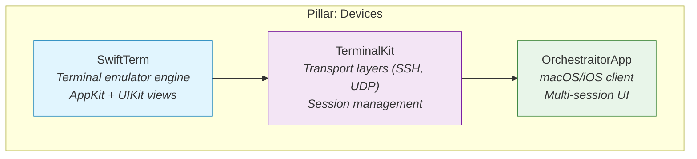
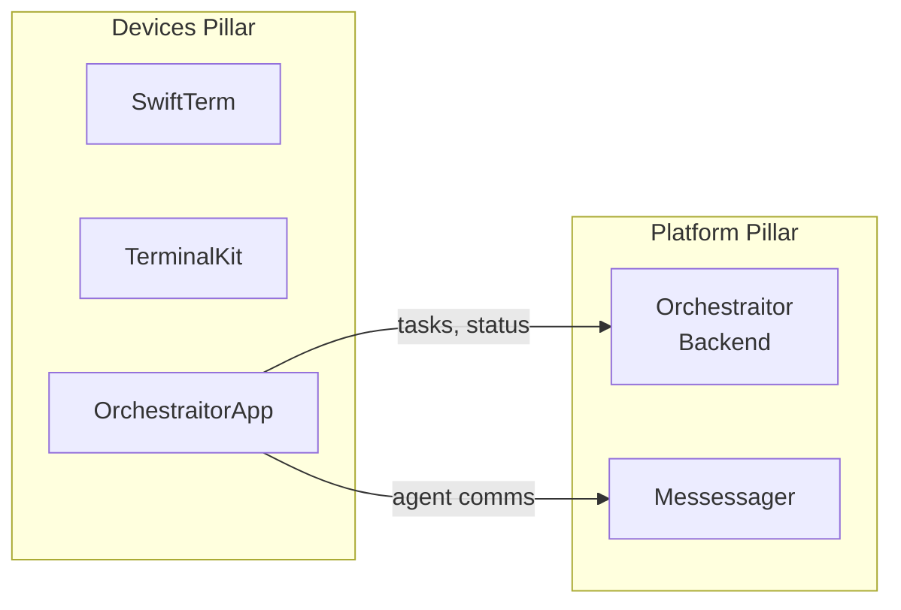

# Ecosystem Map

> **You are here**: SwiftTerm is an upstream dependency of TerminalKit, which connects it to the Orchestraitor ecosystem.

## Where SwiftTerm Fits

SwiftTerm is a **pure terminal emulator library** — it parses escape sequences, manages buffers, and provides platform views. It has no knowledge of networking, SSH, or orchestration. Those concerns live in higher layers.

## Dependency Chain

| Layer | Package | Responsibility |
|-------|---------|----------------|
| **SwiftTerm** | `SwiftTerm` | VT100/Xterm emulation, buffer management, escape sequence parsing, AppKit/UIKit views, headless mode |
| **TerminalKit** | `TerminalKit` | Wraps SwiftTerm with SSH, UDP, and other transports; manages sessions, reconnection, and credential handling |
| **OrchestraitorApp** | `OrchestraitorApp` | End-user macOS/iOS application; multi-tab terminal UI, Orchestraitor agent integration, settings |

## What SwiftTerm Does Not Do

SwiftTerm intentionally excludes:

- **Networking**: No SSH, TCP, UDP, or WebSocket code. See TerminalKit for transport layers.
- **Authentication**: No credential storage or key management.
- **Session persistence**: No reconnection or session save/restore.
- **Agent orchestration**: No awareness of Orchestraitor tasks, agents, or workflows.
- **Multi-tab management**: Single terminal instance per view; tab management belongs to the host application.

This boundary keeps SwiftTerm reusable as a standalone library for any Swift application that needs terminal emulation.

## Ecosystem Pillar: Devices

In the Orchestraitor ecosystem, SwiftTerm belongs to the **Devices** pillar — the set of packages that provide on-device user interfaces and local compute capabilities.

## For Contributors

- Changes to SwiftTerm's public API may require corresponding updates in **TerminalKit**.
- If you modify delegate protocols or view signatures, check downstream consumers.
- SwiftTerm's DocC catalog (`Sources/SwiftTerm/Documentation.docc/`) should be updated for any public API change.
- These docs (`docs/`) should be updated for architectural or structural changes.
